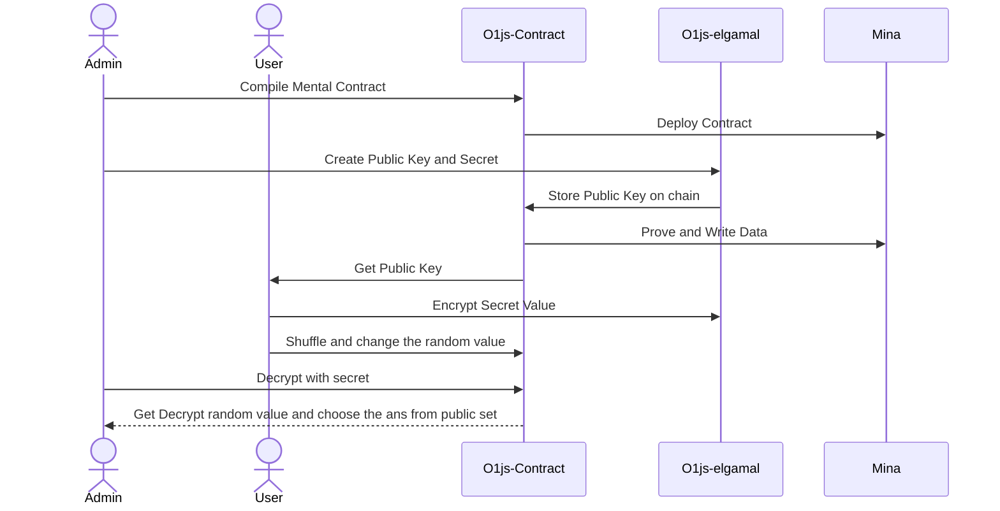

<h1>Doro</h1>

 The Future of Fair Lottery Systems

</img>

### Relate Repo & Demo Link
- [Mobile App](https://github.com/hollow-leaf/doro-mobile/)
- [Berkeley ZKapp: 62qrmRifvNnkRaKqw62Z84JGS5dn6cAgvZtLXsDpRLRH4zrxjLhCti ](https://minascan.io/berkeley/account/B62qrmRifvNnkRaKqw62Z84JGS5dn6cAgvZtLXsDpRLRH4zrxjLhCti/zkApp?type=zk-acc)

### Problem & Solution
- Secure and Participative: Doro revolutionizes lottery systems with advanced cryptographic technology. At its core is the ElGamal homomorphic encryption algorithm, ensuring absolute security and fairness.

- How It Works: Each participant's entry is encrypted using ElGamal, a homomorphic encryption method. This encrypted data is then multiplied with a number on the blockchain. This unique process introduces a high level of randomness, making the lottery outcomes truly unpredictable.

- Fairness and Transparency: Prior to the draw, no one knows the sequence of entries, guaranteeing a level playing field for all participants. Doro's use of Zero-Knowledge Proofs (ZKPs) alongside homomorphic encryption further enhances fairness and transparency, allowing for verifiable draws without compromising individual privacy.

- User Engagement: Our system not only ensures fair play but also increases user engagement. Participants can trust the process, knowing their chances are as random and secure as the technology behind it.

- Conclusion: Doro is more than a lottery system; it's a testament to how cryptography can transform user experience and trust in digital platforms. Join us in embracing a new era of fair, secure, and engaging lottery systems.

### Tech Stack 
- `Mina Protocal`: Berkeley Contract
- `o1js-elgamal`: for encrypt random value
- `react native`: build hybrid mobile application
- `express`: mobile interact with chain
 
### Build & Infra
> Doro is a monorepo managed using turbo. You can find the source code for each package in the `apps` and `packages` directory.

- `apps/backend`
- `packages/contract` 

### Tech Architecture
