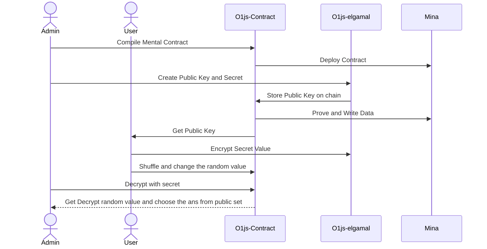

### MINA Contract Design

```mermaid
sequenceDiagram
    actor A as Admin
    actor U as User
    participant C as O1js-Contract
    participant E as O1js-elgamal
    participant M as Mina

    %% Compile
    A ->> C: Compile Mental Contract
    C ->> M: Deploy Contract
    
    %% Contract
    A ->> E: Create Public Key and Secret
    E ->> C: Store Public Key on chain
    C ->> M: Prove and Write Data
    
    %% Shuffle
    C ->> U: Get Public Key
    U ->> E: Encrypt Secret Value
    U ->> C: Shuffle and change the random value

    %% Reveal
    A ->> C: Decrypt with secret
    C -->> A: Get Decrypt random value and choose the ans from public set
```